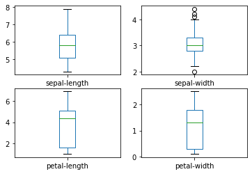
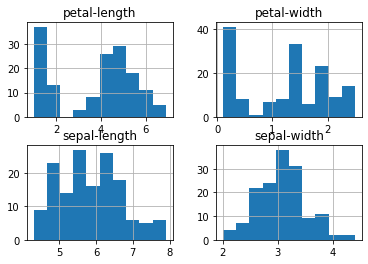
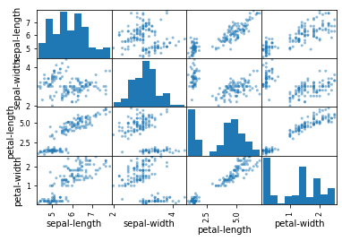

# Section 1

#### Most popular and used libraries in ML are
1. scikit learn
2. matplotlib
3. pandas
4. numpy
5. scipy


```python

import numpy 
import scipy
import matplotlib
import pandas
import sklearn

```

# Import Libraries we are going to use 


```python

# Load libraries
from pandas import read_csv
from pandas.plotting import scatter_matrix
from matplotlib import pyplot
from sklearn.model_selection import train_test_split
from sklearn.model_selection import cross_val_score
from sklearn.model_selection import StratifiedKFold
from sklearn.metrics import classification_report
from sklearn.metrics import accuracy_score
from sklearn.linear_model import LogisticRegression
from sklearn.tree import DecisionTreeClassifier
from sklearn.neighbors import KNeighborsClassifier

```

## Load Dataset using pandas


```python
url="https://raw.githubusercontent.com/jbrownlee/Datasets/master/iris.csv"
#specifying names of each column
names=['sepal-length','sepal-width','petal-length','petal-width','class']
dataset=read_csv(url,names=names)
```


```python
#Dimension of the dataset
print(dataset.shape)
```

    (150, 5)
    


```python
#get first n data
print(dataset.head(20))
```

        sepal-length  sepal-width  petal-length  petal-width        class
    0            5.1          3.5           1.4          0.2  Iris-setosa
    1            4.9          3.0           1.4          0.2  Iris-setosa
    2            4.7          3.2           1.3          0.2  Iris-setosa
    3            4.6          3.1           1.5          0.2  Iris-setosa
    4            5.0          3.6           1.4          0.2  Iris-setosa
    5            5.4          3.9           1.7          0.4  Iris-setosa
    6            4.6          3.4           1.4          0.3  Iris-setosa
    7            5.0          3.4           1.5          0.2  Iris-setosa
    8            4.4          2.9           1.4          0.2  Iris-setosa
    9            4.9          3.1           1.5          0.1  Iris-setosa
    10           5.4          3.7           1.5          0.2  Iris-setosa
    11           4.8          3.4           1.6          0.2  Iris-setosa
    12           4.8          3.0           1.4          0.1  Iris-setosa
    13           4.3          3.0           1.1          0.1  Iris-setosa
    14           5.8          4.0           1.2          0.2  Iris-setosa
    15           5.7          4.4           1.5          0.4  Iris-setosa
    16           5.4          3.9           1.3          0.4  Iris-setosa
    17           5.1          3.5           1.4          0.3  Iris-setosa
    18           5.7          3.8           1.7          0.3  Iris-setosa
    19           5.1          3.8           1.5          0.3  Iris-setosa
    

# Description of the dataset


```python
print(dataset.describe())

```

           sepal-length  sepal-width  petal-length  petal-width
    count    150.000000   150.000000    150.000000   150.000000
    mean       5.843333     3.054000      3.758667     1.198667
    std        0.828066     0.433594      1.764420     0.763161
    min        4.300000     2.000000      1.000000     0.100000
    25%        5.100000     2.800000      1.600000     0.300000
    50%        5.800000     3.000000      4.350000     1.300000
    75%        6.400000     3.300000      5.100000     1.800000
    max        7.900000     4.400000      6.900000     2.500000
    


```python
dataset.plot(kind='box', subplots=True, layout=(2,2), sharex=False, sharey=False)
pyplot.show()
```





# Class Distribution
##### See the instances (rows) that belong to each class


```python
print(dataset.groupby('class').size())
```

    class
    Iris-setosa        50
    Iris-versicolor    50
    Iris-virginica     50
    dtype: int64
    


```python
...
# histograms
dataset.hist()
pyplot.show()
```





```python
# scatter plot matrix
scatter_matrix(dataset)
pyplot.show()
```





# Evaluate Some Algorithms
#### Now it is time to create some models of the data and estimate their accuracy on unseen data.

1. Separate out a test dataset.
2. Set-up the test harness to use 10-fold cross validation.
3. Build multiple different models to predict species from flower measurements
4. Select the best model.


```python
#separate dataset to 20% test, 80% train
array = dataset.values
X = array[:,0:4]
y = array[:,4]
X_train, X_test, Y_train, Y_test = train_test_split(X, y, test_size=0.20, random_state=1)
```


```python
models = []
models.append(('KNN', KNeighborsClassifier()))
models.append(('CART', DecisionTreeClassifier()))
# evaluate each model in turn
results = []
names = []
for name, model in models:
	kfold = StratifiedKFold(n_splits=10, random_state=1, shuffle=True) #10 groups each group of 12 rows(4 samples for each class) 
	cv_results = cross_val_score(model, X_train, Y_train, cv=kfold, scoring='accuracy')
	results.append(cv_results)
	names.append(name)
	print('%s: %f (%f)' % (name, cv_results.mean(), cv_results.std()))
#print('kFold',kfold)

```

    KNN: 0.958333 (0.041667)
    CART: 0.958333 (0.041667)
    


```python
# for validation of the models use X_validation

model = KNeighborsClassifier()
model.fit(X_train, Y_train)
predictions = model.predict(X_test)
```


```python
pred_arr=[]
for pred in predictions:
    pred_arr.append(pred)
print(pred_arr)
```

    ['Iris-setosa', 'Iris-versicolor', 'Iris-versicolor', 'Iris-setosa', 'Iris-virginica', 'Iris-versicolor', 'Iris-virginica', 'Iris-setosa', 'Iris-setosa', 'Iris-virginica', 'Iris-versicolor', 'Iris-setosa', 'Iris-virginica', 'Iris-versicolor', 'Iris-versicolor', 'Iris-setosa', 'Iris-versicolor', 'Iris-versicolor', 'Iris-setosa', 'Iris-setosa', 'Iris-versicolor', 'Iris-versicolor', 'Iris-versicolor', 'Iris-setosa', 'Iris-virginica', 'Iris-versicolor', 'Iris-setosa', 'Iris-setosa', 'Iris-versicolor', 'Iris-virginica']
    


```python
print(Y_test)
```

    ['Iris-setosa' 'Iris-versicolor' 'Iris-versicolor' 'Iris-setosa'
     'Iris-virginica' 'Iris-versicolor' 'Iris-virginica' 'Iris-setosa'
     'Iris-setosa' 'Iris-virginica' 'Iris-versicolor' 'Iris-setosa'
     'Iris-virginica' 'Iris-versicolor' 'Iris-versicolor' 'Iris-setosa'
     'Iris-versicolor' 'Iris-versicolor' 'Iris-setosa' 'Iris-setosa'
     'Iris-versicolor' 'Iris-versicolor' 'Iris-versicolor' 'Iris-setosa'
     'Iris-virginica' 'Iris-versicolor' 'Iris-setosa' 'Iris-setosa'
     'Iris-versicolor' 'Iris-virginica']
    


```python

```


```python

```


```python

```
